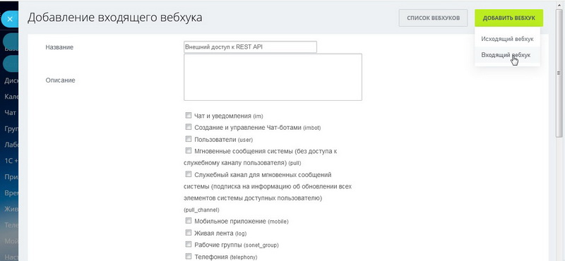
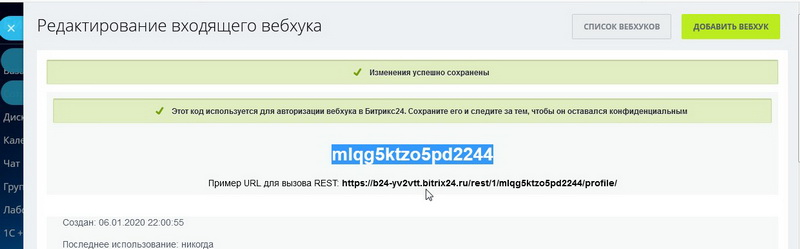

# Bitrix24 Java API  [](http://hits.dwyl.io/JavaStream/bitrix24-java-api)

Java Library for easy work with **CRM Bitrix24.ru** 

Now you can work only with the **Client Card**. Other features coming soon!

### Connection and functionalities:
1. **Create account and webhook token**



2. **Add Maven dependency** 
```xml
<repositories>
   <repository>
      <id>bitrix24-java-api-mvn-repo</id>
	  <url>https://raw.github.com/JavaStream/bitrix24-java-api/mvn-repo/</url>
		 <snapshots>
		     <enabled>true</enabled>
			  <updatePolicy>always</updatePolicy>
		 </snapshots>
   </repository>
</repositories>

<dependency>
    <groupId>com.javastream</groupId>
    <artifactId>java-bitrix24-api</artifactId>
    <version>0.0.1-SNAPSHOT</version>
 </dependency>
  ```

3. **Init Client in your project**
You need insert yours Token and bitrix-account. It's easy!

```java
// Init Client
Client client = new Client("mlqg5ktzo5pd2244", "b24-yv2vtt.bitrix24.ru");
```

4. **Create New Contact**

```java
// Init Client
Client client = new Client("mlqg5ktzo5pd2244", "b24-yv2vtt.bitrix24.ru");

// Create a new Contact card and fill in its fields
Contact contact = new Contact();

// Mandatory method. Without the name and lastName parameters, the card cannot be saved.
contact.add_name_and_lastName("Robert", "Kane");

contact.setLAST_NAME("Edward");

// Contact type -> in Type_id you can select 1 of 4 options
contact.setTYPE_ID(Type_id.CLIENT.getCode());

// Comment field
contact.add_comments("He is the best");

// Post field
contact.add_post("Manager");

// Attach a company card (requires company ID)
contact.add_company(2);

// Adding a phone. Phone type is set in Phone_type
contact.add_phone("89119500085", Phone_type.MOBILE);
contact.add_phone("500-00-90", Phone_type.WORK);
contact.add_phone("500-00-92", Phone_type.FAX);

// Adding email. Phone type is set in Email_type
contact.add_email("robert@gmail.com", Email_type.PRIVATE);
contact.add_email("robert.dia@digital.com", Email_type.WORK);

// Adding a site. Phone type is set in Website_type
contact.add_website("www.digital.com", Website_type.WORK);
contact.add_website("www.facebook.com/robert", Website_type.FACEBOOK);

// Adding instant messengers. Messengers type is set in Messengers_type
contact.add_messenger("roby-tgr", Messengers_type.TELEGRAM);
contact.add_messenger("roby-van", Messengers_type.VIBER);

// At the end Save the created contact in CRM
client.getContactService().addNewContact(contact);
```

5. **Get Contact By Id**

```java
// Init Client
Client client = new Client("token", "your-account.bitrix24.ru");

// We get the contact card by contact ID (For example, 74)
Contact contact = client.getContactService().getContactById(74);

```
