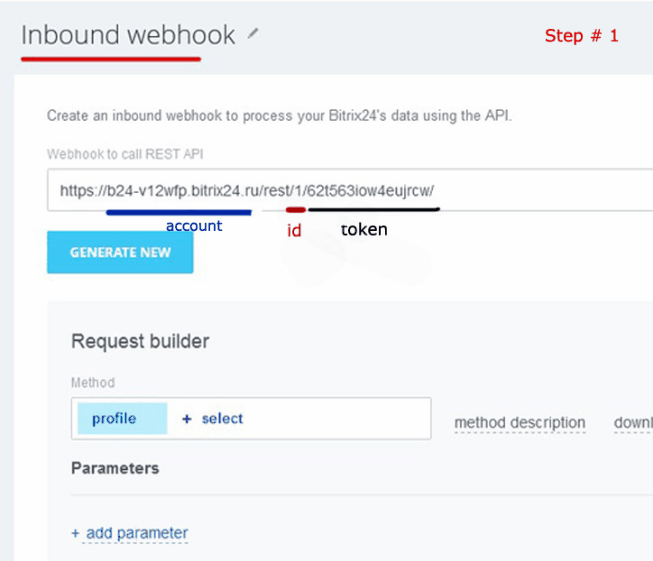

# Bitrix24 Java API 

---

<p align="center">
<sup>
<b> This Java project is designed to be simple and efficient. Now you can work with **CRM Bitrix24.ru** using our API, that provide good functionality. 
Essentially, API provided work with Contact, Lead, Company, Product, Product Section and Chat. If you have any questions send me an email: javastream.msn@gmail.com  </b> 
</sup>
</p>

---


[](https://github.com/releases)
[![GitHub contributors][contributors-image]][contributors-url]
[](http://hits.dwyl.io/JavaStream/bitrix24-java-api)
[](https://github.com/JavaStream/bitrix24-java-api/releases)


[contributors-url]: https://github.com/JavaStream/bitrix24-java-api/graphs/contributors
[contributors-image]: https://img.shields.io/github/contributors/JavaStream/bitrix24-java-api.svg


QUICK START
------------

>Step 1. Add dependency:

**For Maven project:**

``` XML
<repositories>
	<repository>
	   <id>jitpack.io</id>
	   <url>https://jitpack.io</url>
    </repository>
</repositories>
```

``` XML
<dependency>
    <groupId>com.github.JavaStream</groupId>
    <artifactId>bitrix24-java-api</artifactId>
    <version>v2022.1</version>
</dependency>
```


**For Gradle project:**

``` XML
allprojects {
    repositories {
        ...
        maven { url 'https://jitpack.io' }
    }
}
```


``` XML
dependencies {
    implementation 'com.github.JavaStream:bitrix24-java-api:1.3'
}
```


>Step 2. Create an account and webhook token




>Step 3. Init Client in your project.
You need insert yours Token, bitrix-account and rest_id. It's easy!

```Java
// Init Client
Client client = new Client("token", "your-account.bitrix24.ru", rest_id);

```


EXAMPLES
-----------

**Contact**  

```java
// 1. Create a new Contact (name and lastname are mandatory fields)

Contact contact = new Contact("Robert", "Kane"); 
contact.setTypeId(TypeIdContact.CLIENT.getCode());
contact.setPhones(phoneList);
contact.setAddress("USA, Delaware");
contact.setComments("best contact");
contact.setCompanyId("2");
client.contactService().add(contact);

// 2. Get a Contact by ID (For example, 74)
Contact contact = client.contactService().get(74);

// 3. Delete a Contact
client.contactService().delete(72);

// 4. Update a Contact
contact.setCompanyId("2");
contact.setName("Джон");
client.contactService().update(contact);
```


**Lead**

```java
// 1. Create a new Lead	
Lead lead = new Lead();
lead.setTitle("Test2");
lead.setSourceId(SourceIdType.ADVERTISING.getCode());
lead.setAddress("England, Rosenberg str, 100");
Phone phone = Phone.builder()
		.value("89110225686").valueType(PhoneType.HOME.getCode()).build();
List<Phone> listPhones = new ArrayList<>();
listPhones.add(phone);
lead.setPhones(listPhones);
client.leadService().add(lead);

// 2. Get a Lead by ID 
Lead lead = client.leadService().get(2);

// 3. Delete a Lead 
client.leadService().delete(8);

// 4. Update a Lead 
// Simple fields (like String) can just set new data
lead.setName("Albert");
lead.setLastName("Shtein");
lead.setAddress("West Olympic Boulevard Apt. 100");
lead.setComments("Interested in price");
lead.setStatusId(StatusIdType.NEW.getCode());
lead.setCurrencyId(CurrencyIdType.EUR.getCode());
lead.setSourceId(SourceIdType.RECOMMENDATION.getCode());
client.leadService().update(lead);
```

**Company**

The way of working with the Company is the same as with other entities.

```java
//1. Create New Company
Company company = new Company();
company.add_companyTitle("LLT Prizma");
company.add_companyType(Company_type.PARTNER);
company.add_employeesType(Employees_type.FROM_250_TO_500);
company.add_industryType(Industry_type.BANKING);

//2. Get company by ID
Company company = client.getCempanyService().getCompanyById(2);

//3. Delete company by ID 
client.getCempanyService().deleteCompanyById(3);

//4.1. Update simple fields
company.setBANKING_DETAILS("r/s 40702810865698252");
company.setCOMPANY_TYPE(Company_type.SUPPLIER.getCode());
company.setADDRESS("Olympic Boulevard Apt. 120");
company.setCOMMENTS("Interested in price");

//4.2. Update multiple fields Website
Website website = company.getWEB().get(0);
website.setVALUE("www.albert12.org");
website.setVALUE_TYPE(Website_type.OTHER.getCode());
List<Website> websitList = new ArrayList<>();
websitList.add(website);
company.setWEB(websitList);
client.getCempanyService().updateCompany(company);

//5. Add new multiple fields (for example, Email)
Company company = client.getCempanyService().getCompanyById(2);
List<Email> listEmail = new ArrayList<>();
Email email = Email.builder()
	.VALUE("srtur12@gmail.com").VALUE_TYPE(Email_type.PRIVATE.getCode()).build();
listEmail.add(email);
company.setEMAIL(listEmail);
client.getCempanyService().updateCompany(company);
```

**Product**
```java
// Create
Product product = new Product();
product.setNAME("MainRouter");
client.getProductService().addProduct(product);

// Get, Delete and Update 
Product product = client.getProductService().getProduc(4);
client.getProductService().deleteProduct(6);
client.getProductService().updateProduct(product);
```

**Product Section**
```java
// Create
ProductSection productSection = new ProductSection();
productSection.add_name("Auto");
productSection.setSECTION_ID(12);  // ID of Main category

// Get, Delete and Update 
ProductSection productSection = client.getProductSectionService().getProductSection(16);
client.getProductSectionService().deleteProductSection(2);
client.getProductSectionService().updateProductSection(productSection);
```

**Chats with a Leads**

Soon we will add functionality for working with dialogs and messages.

```java

Lead lead = client.getLeadService().getLeadById(42);                                      // Get a Lead (for example, id = 42)
Chat chat = client.getChatService().getChat(lead);                                        // Get the chat whith this Lead
List<User> userList = client.getChatService().getUsers(chat);                             // Get the list of users in this chat 
List<User> userList = client.getChatService().getListBusinessUsers();                     // Get a list of all business users
client.getChatService().muteNotifications(chat, ChatNotifications_type.YES.getCode());    // Turn off chat notifications 

// Adding a new chat for Lead = 42. The field MESSAGE cannot be empty!
Chat chatNew = new Chat();
chatNew.setCOLOR(ChatColors_type.AZURE.getCode());
chatNew.setDESCRIPTION("Conversation with a client #42");
chatNew.setMESSAGE("Hello customer #42!");
chatNew.setTITLE("Customer " + lead.getTITLE());

client.getChatService().createChat(chatNew, lead, userList);

```

